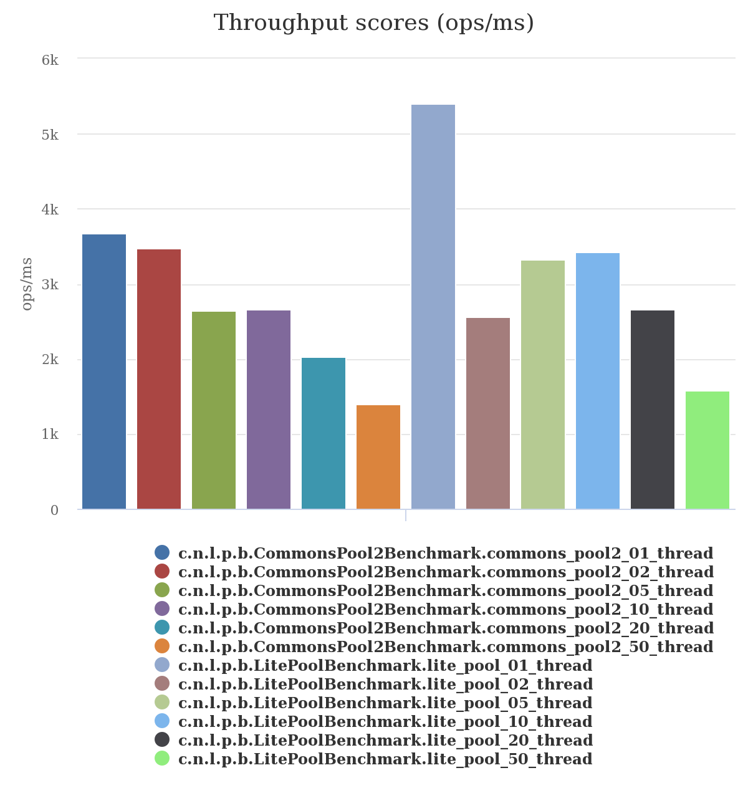

Table of Contents([中文说明](./README.zh_CN.md))
=================

   * [1. Lite-pool](#1-lite-pool)
      * [1.1. Brief introduction](#11-brief-introduction)
      * [1.2. Requirements](#12-requirements)
      * [1.3. Maven dependency](#13-maven-dependency)
      * [1.4. Install from source code](#14-install-from-source-code)
   * [2. Usage](#2-usage)
      * [2.1. PoolBuilder](#21-poolbuilder)
      * [2.2. Standalone usage](#22-standalone-usage)
      * [2.3. Spring integration](#23-spring-integration)
   * [3. PoolListener](#3-poollistener)
   * [4. Write your own PoolAllocator](#4-write-your-own-poolallocator)
   * [5. JMX](#5-jmx)
   * [6. Benchmark](#6-benchmark)


# 1. Lite-pool  
## 1.1. Brief introduction  
[](https://travis-ci.org/nextopcn/lite-pool)
[](https://coveralls.io/github/nextopcn/lite-pool?branch=master)
[](https://maven-badges.herokuapp.com/maven-central/cn.nextop/lite-pool)
[](http://www.javadoc.io/doc/cn.nextop/lite-pool)
[](https://github.com/nextopcn/lite-pool/blob/master/LICENSE)  
  
A lite fast object pool written by Java.  

## 1.2. Requirements  
jdk 1.8+  
maven-3.2.3+  

## 1.3. Maven dependency

```xml  
    <dependency>
        <groupId>cn.nextop</groupId>
        <artifactId>lite-pool</artifactId>
        <version>1.0.0-RC1</version>
    </dependency>
```

## 1.4. Install from source code  

``` 
    $mvn clean install -Dmaven.test.skip=true
```  

# 2. Usage  
## 2.1. PoolBuilder  

| **Config** | **Default value** | **Details**                                                                              |
| ---------- | ----------------- | -----------------------------------------------------------------------------------------|
| minimum    | 0                 | minimum allowed objects in pool                                                          |
| maximum    | 16                | maximum allowed objects in pool                                                          |
| tti        | 15 minutes        | time to idle, optional maximum pool objects' idle time, unit ms                          |
| ttl        | 60 minutes        | time to live, optional maximum pool objects' life time, unit ms                          |
| tenancy    | 1  minutes        | optional leak detection timeout, unit ms, (**MUST** >= `interval`)                       |
| timeout    | 8  seconds        | default acquire timeout, unit ms                                                         |
| interval   | 15 seconds        | default house keeping scheduler's interval, unit ms                                      |
| local      | true              | use `ThreadAllocator` as L1 cache or not                                                 |
| verbose    | false             | print log or not                                                                         |
| fifo       | false             | pool allocation policy, `false` has better performance                                   |
| allocator  | DefaultAllocator  | pool allocator, can be customized by extending `AbstractAllocator`                       |
| supplier   |                   | required callback for creating pool objects                                              |
| consumer   |                   | optional callback for destroying pool objects                                            |
| validator  |                   | optional callback for validating pool objects                                            |
| validation | PULSE             | precondition for `validator`, e.g : `new PoolValidation((byte)(PULSE\|ACQUIRE\|RELEASE))`|
  

## 2.2. Standalone usage  

```java  
    public class YourPoolObject {
    }
    
    Pool<YourPoolObject> pool = new PoolBuilder<YourPoolObject>()
                    .local(true) // using thread local
                    .supplier(() -> new YourPoolObject())
                    .interval(interval)
                    .minimum(minimum)
                    .maximum(maximum)
                    .timeout(timeout)
                    .ttl(ttl)
                    .tti(tti)
                    .verbose(true)
                    ...
                    .build("object pool");
    pool.start();
    try {
        for(int i = 0; i < 1000; i++) {
            YourPoolObject object = null;
            try {
                object = pool.acquire();
                if (object != null) {
                    // your code goes here. 
                }
            } finally {
                if (object != null) pool.release(object);
            }
        }
    } finally {
        pool.stop();
    }
```

## 2.3. Spring integration  
  

```java  
    public class YourPoolObject {
    }
    
    public class Factory implements Supplier<YourPoolObject> {
        @Override
        public YourPoolObject get() {
            return new YourPoolObject();
        }
    }

```
  
Spring configuration:  
  
```xml  

    <bean id="your.object.pool" class="cn.nextop.lite.pool.impl.ObjectPool" 
        init-method="start" destroy-method="stop">
        <constructor-arg index="0" value="your.object.pool"/>
        <property name="config" ref="your.object.pool.config"/>
    </bean>
        
    <bean id="your.object.pool.config" class="cn.nextop.lite.pool.PoolConfig" 
        scope="prototype">
        <property name="minimum" value="10"/>
        ...
        <property name="supplier" ref="your.object.pool.factory"/>
    </bean>
        
    <bean id="your.object.pool.factory" class="your.package.Factory"/>
```

# 3. PoolListener

```java  
    Pool<YourPoolObject> pool = new PoolBuilder<YourPoolObject>()
                    .local(true) // using thread local
                    .supplier(() -> new YourPoolObject())
                    ...
                    .build("object pool");
    pool.addListener(event -> {
        YourPoolObject item = event.getItem();
        switch (event.getType()) {
            case ACQUIRE:
                // your code goes here
                break;
            case RELEASE:
                // your code goes here
                break;
            case LEAKAGE:
                // your code goes here
                break;
            default:
                throw new AssertionError();
        }
    });
    pool.start();
```

# 4. Write your own PoolAllocator

```java  

public class YourPoolAllocator<T> extends AbstractAllocator<T> {

    public YourPoolAllocator(Pool<T> pool, String name) {
        super(pool, name);
    }

    @Override
    protected Slot<T> doRelease(T t) {
        // if uses thread local as L1 cache, thread allocator will try to acquire without delegating to 
        // parent allocator, but always delegate to parent to release. that requires your allocator is 
        // able to remove duplication on release.
        //
        // if pool object is invalidated, your allocator should delete it and invoke super.consume(t).
        //
        // please refer to DefaultAllocator and AllocationQueue for more details.
        return null;
    }

    @Override
    protected Slot<T> doAcquire(long timeout, TimeUnit unit) {
        // returns null if timeout or thread is interrupted.
        // if the acquired object is invalid and do not reach out timeout, do following steps:
        // step1 : permanently delete it and invoke super.consume(t).
        // step2 : acquire again until timeout.
        //
        // please refer to DefaultAllocator and AllocationQueue for more details.
        return null;
    }

    public static class Factory<T> implements PoolAllocatorFactory<T> {
        @Override public final PoolAllocator<T> create(final Pool<T> v) {
            String n = v.getName() + ".allocator.your.name"; return new YourPoolAllocator<>(v, n);
        }
    }
}

```
  
Register `YourPoolAllocator` to Pool  
  
```java  

Pool<YourPoolObject> pool = new PoolBuilder<YourPoolObject>()
                    .allocator(new YourPoolAllocator.Factory<>())
                    ...
                    .build("object pool");
```
 
# 5. JMX

MXBean : `cn.nextop.lite.pool:type=PoolConfig`  
  
| **Attribute** | **Modifiable** | **Details**                             |
|---------------|----------------|-----------------------------------------|
| Maximum       | Yes            | see [2.1. PoolBuilder](#21-poolbuilder) |
| Minimum       | Yes            | see [2.1. PoolBuilder](#21-poolbuilder) |
| Tenancy       | Yes            | see [2.1. PoolBuilder](#21-poolbuilder) |
| Timeout       | Yes            | see [2.1. PoolBuilder](#21-poolbuilder) |
| Tti           | Yes            | see [2.1. PoolBuilder](#21-poolbuilder) |
| Ttl           | Yes            | see [2.1. PoolBuilder](#21-poolbuilder) |
| Verbose       | Yes            | see [2.1. PoolBuilder](#21-poolbuilder) |
| Maximum       | Yes            | see [2.1. PoolBuilder](#21-poolbuilder) |
| Maximum       | Yes            | see [2.1. PoolBuilder](#21-poolbuilder) |
  
MXBean : `cn.nextop.lite.pool:type=PoolAllocator`  
  
| **Attribute** | **Modifiable** | **Details**                                                       |
|---------------|----------------|-------------------------------------------------------------------|
| BusyCount     | No             | pool's busy object count, equivalent to `TotalCount - IdleCount`. |
| IdleCount     | No             | pool's idle object count.                                         |
| TotalCount    | No             | pool's total object count.                                        |
| PendingCount  | No             | pool's pending request count.                                     |
  

# 6. Benchmark

Test env:  

```xml  
    OS : Windows 7 Home(64bit)
    CPU: Intel(R) Core(TM) i3-4710 CPU @ 3.70GHz  3.70GHz
    RAM: 8.00 GB
    JDK: java version "1.8.0_151"

```

Test case:  
  
Basic Parameters: 10 minimum, 10 maximum  
  
```java  
    TestObject object = pool.acquire();
    if (object != null) pool.release(object);
```
  
(unit: ops/ms)  
  
Parameters: see [BaseTest.java](./src/test/java/cn/nextop/lite/pool/BaseTest.java)  
  
Benchmark Classes: see [LitePoolBenchmark.java](./src/test/java/cn/nextop/lite/pool/benchmark/LitePoolBenchmark.java) and [CommonsPool2Benchmark.java](./src/test/java/cn/nextop/lite/pool/benchmark/CommonsPool2Benchmark.java)  
  
Run [Benchmark.java](./src/test/java/cn/nextop/lite/pool/benchmark/Benchmark.java)  
  
Use `ThreadAllocator` as L1 cache result:  
  
  
  
Unused `ThreadAllocator` as L1 cache result:  
  
  
  
