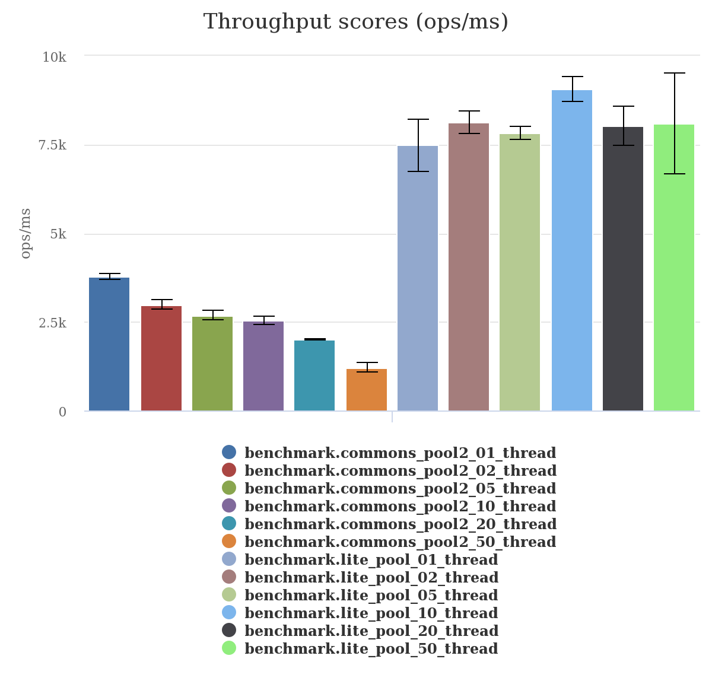

内容索引([Table of Contents](./README.md))  
=================

   * [1. Lite-pool](#1-lite-pool)
      * [1.1. 简介](#11-简介)
      * [1.2. 安装前置条件](#12-安装前置条件)
      * [1.3. Maven依赖](#13-maven依赖)
      * [1.4. 安装源码到本地Maven仓库](#14-安装源码到本地maven仓库)
   * [2. 简要用法](#2-简要用法)
      * [2.1. PoolBuilder](#21-poolbuilder)
      * [2.2. 使用](#22-使用)
   * [3. PoolListener](#3-poollistener)
   * [4. 扩展自己的PoolAllocator](#4-扩展自己的poolallocator)
   * [5. JMX](#5-jmx)
   * [6. 基准测试](#6-基准测试)


# 1. Lite-pool  
## 1.1. 简介  
[](https://travis-ci.org/nextopcn/lite-pool)
[](https://coveralls.io/github/nextopcn/lite-pool?branch=master)
[](https://maven-badges.herokuapp.com/maven-central/cn.nextop/lite-pool)
[](http://www.javadoc.io/doc/cn.nextop/lite-pool)
[](https://github.com/nextopcn/lite-pool/blob/master/LICENSE)  
  
Lite-pool : 轻量快速的对象池  

## 1.2. 安装前置条件  
jdk 1.8+  
maven-3.2.3+  

## 1.3. Maven依赖

```xml  
    <dependency>
        <groupId>cn.nextop</groupId>
        <artifactId>lite-pool</artifactId>
        <version>1.0.0-RC1</version>
    </dependency>
```

## 1.4. 安装源码到本地Maven仓库  

``` 
    $mvn clean install -Dmaven.test.skip=true
```  

# 2. 简要用法  
## 2.1. PoolBuilder  

| **配置项** | **默认值**          |  **详解**                                                                         |
| ---------- | ------------------ | ---------------------------------------------------------------------------------|
| minimum    | 0                  |  pool中所维持的最小对象数量                                                         |
| maximum    | 16                 |  pool中所维持的最大对象数量                                                         |
| tti        | 15 分钟            |  pool中对象的最大空闲时间, 可选项(0表示不过期), 单位: ms                              |
| ttl        | 60 分钟            |  pool中对象的最大生存时间, 可选项(0表示不过期), 单位: ms                              |
| tenancy    | 1  分钟            |  对象泄露检测的超时时间, 可选项(0表示不过期), 单位: ms, (**必须** >= `interval`)       |
| timeout    | 8  秒              |  默认的请求超时时间, 单位: ms                                                       |
| interval   | 15 秒              |  默认的定时检测任务时间间隔, 单位: ms                                                |
| local      | true               |  是否应用 `ThreadAllocator` 作为 L1 缓存                                           |
| verbose    | false              |  是否打印日志                                                                      |
| fifo       | false              |  对象池分配策略, 设置为`false`有更好的性能                                           |
| allocator  | DefaultAllocator   |  对象池分配器, 继承 `AbstractAllocator`可以定制自己的对象池分配器                      |
| supplier   |                    |  创建pool对象的回调方法, 必选项                                                      |
| consumer   |                    |  销毁pool对象的回调方法, 可选项                                                      |
| validator  |                    |  验证pool对象的回调方法, 可选项                                                      |
| validation | PULSE              |  验证pool对象的的前置条件, 例如:`new PoolValidation((byte)(PULSE\|ACQUIRE\|RELEASE))`|  
  

## 2.2. 使用  

```java  
    public class YourPoolObject {
    }
    
    Pool<YourPoolObject> pool = new PoolBuilder<YourPoolObject>()
                    .local(true) // 使用ThreadAllocator作为L1缓存
                    .supplier(() -> new YourPoolObject())
                    .interval(interval)
                    .minimum(minimum)
                    .maximum(maximum)
                    .timeout(timeout)
                    .ttl(ttl)
                    .tti(tti)
                    .verbose(true)
                    ...
                    .build("object pool");
    pool.start();
    try {
        for(int i = 0; i < 1000; i++) {
            YourPoolObject object = null;
            try {
                object = pool.acquire();
                if (object != null) {
                    // 你的业务代码 
                }
            } finally {
                if (object != null) pool.release(object);
            }
        }
    } finally {
        pool.stop();
    }
```

# 3. PoolListener

```java  
    Pool<YourPoolObject> pool = new PoolBuilder<YourPoolObject>()
                    .local(true) // using thread local
                    .supplier(() -> new YourPoolObject())
                    ...
                    .build("object pool");
    pool.addListener(event -> {
        YourPoolObject item = event.getItem();
        switch (event.getType()) {
            case ACQUIRE:
                // 你的业务代码
                break;
            case RELEASE:
                // 你的业务代码
                break;
            case LEAKAGE:
                // 你的业务代码
                break;
            default:
                throw new AssertionError();
        }
    });
    pool.start();
```

# 4. 扩展自己的PoolAllocator

```java  

public class YourPoolAllocator<T> extends AbstractAllocator<T> {

    public YourPoolAllocator(Pool<T> pool, String name) {
        super(pool, name);
    }

    @Override
    protected Slot<T> doRelease(T t) {
        // 如果应用ThrealAllocator作为L1缓存, ThrealAllocator将会尝试在TheadLocal内获得pool中的对象, 如果没
        // 获取到合法的对象，会尝试调用父分配器的acquire方法获得对象, 但是在release的过程中, 会一直调用
        // 父分配器的release方法释放对象, 这样要求你自己实现的分配器在release的时候能够去除重复的对象.
        //
        // 如果pool中对象不合法, 你的分配器应该删除这个对象并调用 super.consume(t).
        //
        // 详细实现请参照DefaultAllocator 和 AllocationQueue.
        return null;
    }

    @Override
    protected Slot<T> doAcquire(long timeout, TimeUnit unit) {
        // 在超时或者线程被中断的情况下返回 null.
        // 如果请求的对象不合法, 并且此时没有超时, 采用如下步骤实现分配器:
        // 步骤1 : 永久删除这个对象并调用 super.consume(t).
        // 步骤2 : 再次从pool中请求对象直到超时.
        //
        // 详细实现请参照DefaultAllocator 和 AllocationQueue.
        return null;
    }

    public static class Factory<T> implements PoolAllocatorFactory<T> {
        @Override public final PoolAllocator<T> create(final Pool<T> v) {
            String n = v.getName() + ".allocator.your.name"; return new YourPoolAllocator<>(v, n);
        }
    }
}

```
  
将 `YourPoolAllocator` 注册到 Pool  
  
```java  

Pool<YourPoolObject> pool = new PoolBuilder<YourPoolObject>()
                    .allocator(new YourPoolAllocator.Factory<>())
                    ...
                    .build("object pool");
```
 
# 5. JMX

MXBean : `cn.nextop.lite.pool:type=PoolConfig`  
  
| **属性**      | **可变更**      | **详解**                                 |
|---------------|----------------|-----------------------------------------|
| Maximum       | 是             | 参照 [2.1. PoolBuilder](#21-poolbuilder) |
| Minimum       | 是             | 参照 [2.1. PoolBuilder](#21-poolbuilder) |
| Tenancy       | 是             | 参照 [2.1. PoolBuilder](#21-poolbuilder) |
| Timeout       | 是             | 参照 [2.1. PoolBuilder](#21-poolbuilder) |
| Tti           | 是             | 参照 [2.1. PoolBuilder](#21-poolbuilder) |
| Ttl           | 是             | 参照 [2.1. PoolBuilder](#21-poolbuilder) |
| Verbose       | 是             | 参照 [2.1. PoolBuilder](#21-poolbuilder) |
| Maximum       | 是             | 参照 [2.1. PoolBuilder](#21-poolbuilder) |
| Maximum       | 是             | 参照 [2.1. PoolBuilder](#21-poolbuilder) |
  
MXBean : `cn.nextop.lite.pool:type=PoolAllocator`  
  
| **属性**      | **可变更**      | **详解**                                                   |
|---------------|----------------|-----------------------------------------------------------|
| BusyCount     | 否             | pool中处于繁忙状态的对象数量, 等价于 `TotalCount - IdleCount` |
| IdleCount     | 否             | pool中处于空闲状态的对象数量.                                |
| TotalCount    | 否             | pool中总的对象数量.                                         |
| PendingCount  | 否             | pool中处于等待请求的对象数量.                                |
  

# 6. 基准测试

测试环境 :  

```xml  
    OS : Windows 7 Home(64bit)
    CPU: Intel(R) Core(TM) i3-4710 CPU @ 3.70GHz  3.70GHz
    RAM: 8.00 GB
    JDK: java version "1.8.0_151"

```

测试用例 :  
  
基本参数: 10 minimum, 10 maximum  
  
```java  
    TestObject object = pool.acquire();
    if (object != null) pool.release(object);
```
  
(单位: ops/ms)  
  
测试参数: 参照 [BaseTest.java](./src/test/java/cn/nextop/lite/pool/BaseTest.java)  
  
测试类: 参照 [LitePoolBenchmark.java](./src/test/java/cn/nextop/lite/pool/benchmark/LitePoolBenchmark.java) 和 [CommonsPool2Benchmark.java](./src/test/java/cn/nextop/lite/pool/benchmark/CommonsPool2Benchmark.java)  
  
运行 [Benchmark.java](./src/test/java/cn/nextop/lite/pool/benchmark/Benchmark.java)  
  
结果:  
  
  
  
